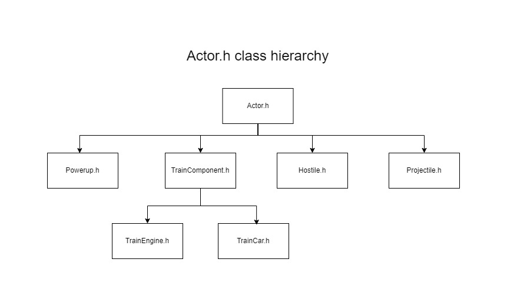

# Controls

| Key       | Action                                                |
|-----------|-------------------------------------------------------|
|W          | Accelerate                                            |
|S          | Decelerate                                            |
|A          | Turn locomotive left                                  |
|D          | Turn locomotive right                                 |
|Mouse      | Move camera (outside combat)                          |
|Shift      | Lock on to target (when prompted)                     |
|Up arrow   | Cycle active train carriage up (when target locked)   |
|Down arrow | Cycle active train carriage up (when target locked)   |
|Spacebar   | Shoot (when target locked)                            |
|R          | Reset camera (outside combat)                         |
|P          | Pause game                                            |
|M          | Enable debug view                                     |

# Screencast
https://youtu.be/jCESNKPmUB0

# Class hierarchy and interfaces
## The Actor class
There's a relatively simple class hierarchy in this game, with most in-game objects inheriting from the `Actor` class.
`Actor` is analogous to the class of the same name in Unreal Engine in that it represents anything which can be spawned in the world.
Here's the class hierarchy for `Actor`

## Interfaces
Besides inheritence, this game also makes use of a number of interfaces. Classes which implement these interfaces can be treated
interchangeably as those interfaces.
 
For example, the `Train` class contains a vector of `TrainComponents`. When `Train::update()` is called, each of the `TrainComponents` in this vector are updated.
This presents a problem, because a `TrainComponent` doesn't have an update function. This would mean when we want to update each `TrainComponent`, we would
first need to check whether it's a `TrainEngine` or a `TrainCar` and the call the relevant update method.
 
With the `IUpdatable` interface, we can simply have `TrainComponent` inherit from `IUpdatable, which in turn causes `TrainEngine` and `TrainCar` to inherit from
`IUpdatable`. All classes which inherit from `IUpdatable` must have an `update()` method, so at runtime we can cast all `TrainComponents` to `IUpdatables` and
invoke their `update()` method.

Interfaces are described seperately from regular classes in the [interfaces](src/interfaces/) folder.
 
Here's a list of the interfaces, what they do and which classes inherit from them:

| Interface         | Purpose                                                                                                       | Implementors                                                                                                      |
|-------------------|---------------------------------------------------------------------------------------------------------------|-------------------------------------------------------------------------------------------------------------------|
| ICombatant        | Defines combat-related variables and functionality                                                            | Hostile.h, Train.h                                                                                                |
| IKeyboardListener | Used in conjunction with [InputManager](src/globals/InputManager.h) to allow classes to accept keyboard input | CombatManager.h, FollowCam.h, TrainEngine.h, GameStateManager.h, SpaceTrainDebug.h                                |
| IUpdatable        | Used to make give a class an update method                                                                    | CombatManager.h, FollowCam.h, Hostile.h, ParallaxBackground.h, Projectile.h, Train.h, TrainComponent.h, UIManager.h, InputManager.h   |

# Asset credits

| Asset name                | Type      | Source                            | Link                                                                                                  |
|---------------------------|-----------|-----------------------------------|-------------------------------------------------------------------------------------------------------|
| bullet_fire.wav           | Audio     | freesound.org user MATRIXXX_      | https://freesound.org/people/MATRIXXX_/sounds/414885/                                                 |
| engine.wav                | Audio     | freesound.org user starkadr       | https://freesound.org/people/Starkadr/sounds/641194/                                                  |
| explosion.wav             | Audio     | freesound.org user V-ktor         | https://freesound.org/people/V-ktor/sounds/435413/                                                    |
| laser_hit.wav             | Audio     | freesound.org user lavik89        | https://freesound.org/people/lavik89/sounds/168984/                                                   |
| missile_fire.wav          | Audio     | freesound.org user MATRIXXX_      | https://freesound.org/people/MATRIXXX_/sounds/441373/                                                 |
| ducky.obj                 | Model     | cgtrader.com user CGStuffStudios  | https://www.cgtrader.com/free-3d-models/sports/toy/rubber-duck-b31f3585-0347-4532-bd92-7ddea6107d0d   |
| train_engine.obj          | Model     | cgtrader.com user PixelYards      | https://www.cgtrader.com/3d-models/vehicle/train/historic-steam-train                                 |
| ufo.obj                   | Model     | Turbosquid user JonLundy3D        | https://www.turbosquid.com/3d-models/free-3ds-model-flying-saucer/1081073                             |
| wagon.obj                 | Model     | Turbosquid user mieszas           | https://www.turbosquid.com/3d-models/3d-wooden-train-cars-model/1066200                               |
| ducky_albedo.png          | Texture   | cgtrader.com user CGStuffStudios  | https://www.cgtrader.com/free-3d-models/sports/toy/rubber-duck-b31f3585-0347-4532-bd92-7ddea6107d0d   |
| train_engine_specular.png | Texture   | cgtrader.com user PixelYards      | https://www.cgtrader.com/3d-models/vehicle/train/historic-steam-train                                 |
| ufo.obj                   | Texture   | Turbosquid user JonLundy3D        | https://www.turbosquid.com/3d-models/free-3ds-model-flying-saucer/1081073                             |
| wagon_albedo.obj          | Texture   | Turbosquid user mieszas           | https://www.turbosquid.com/3d-models/3d-wooden-train-cars-model/1066200                               |
| ds_digi.ttf               | Font      | dafont.com user Dusit Supasawat   | https://www.dafont.com/ds-digital.font                                                                |
| space_wham.ttf            | Font      | dafont.com user Zephram           | https://www.dafont.com/space-wham.font                                                                |
| shift_key_icon.png        | Image     | flaticon.com                      | https://www.flaticon.com/free-icons/shift                                                             |

# TODO
This TODO list uses the "MoSCoW method" of prioritization, i.e. items are divided into `Must`, `Should`, `Could` and `Won't` (or `Would`)

## MUST
- Comments in all .h files
- Organise code
- Clean up unused includes

## SHOULD
- Change the lock-on UI to work like the game over screen
- Update the target lock UI to be drawn in the same way the game over screen is
- Round the speed shown in the UI to some sensible number
- Resize textures
- Play a sound effect when the player collects a powerup
- Make train component selection UI vertical
- Make a diffuse map for the train engine model
- Limit rotation of the engine based on the car behind it
- Limit lock-on by distance
- ICombatant should be virtual/abstract in the same way IUpdatable is
- Make repeat fire work if the fire button is held down
- Update selected component UI so it's less confusing
- Create IMouseListener so things can take mouse input properly
    - Update FollowCam to implement IMouseListener
- Add turret models
- Make turret models rotate to face the direction the camera faces

## COULD
- Add nametags to enemies to make them easier to spot
- Add UI to show damage being dealt to enemies
- Add UI to show damage being dealt to player
- Add a health bar
- Add a menu system
- Implement an UpdateManager
- Give Hostiles a "morale" attribute which would determine how easily they enter the flee state and how soon they get back into combat

## WON'T
- Update target display UI to show a visual representation of the current target
- Add DR and DT to Hostiles
- Add DR and DT to the train
